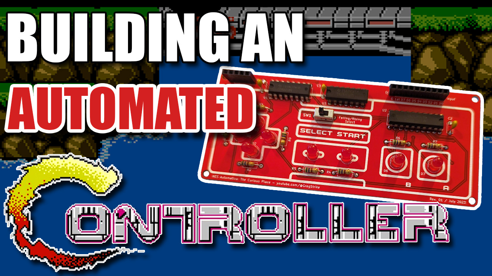

# The Curious Place - NES Controller
A comfortable place for the code from my NES Controller on YouTube (https://www.youtube.com/@GregStrike).  

In this video, we created a programmable & automated DIY NES Controller for the original Nintendo Entertainment System released back in 1985.  As part of that project, I created a Python script that's capable of converting FCEUX .FM3 files directly to a Kansas City Standard .WAV file.  It's a mess really, and has timing issues, but, thought some people may be interested in it.  In reality, there probably needs to be some feedback mechanism so the controller knows which frame of the game we're in.  This is likely coming soon! :)

<!-- PROJECT LOGO -->
 

  

  <h3 align="center">A Programmable & Automated DIY NES Controller</h3>

<!-- GETTING STARTED -->
## YouTube Videos
* The Curious Place 007 - Automating the Orignal NES w/ DIY NES Controller - https://youtu.be/XF2j6qhN4BM
* The Curious Place 008 - Frame Perfect NES Automation! - https://youtu.be/5ESqwEplBKc

## Test Files
In the <a href="Video-007/">Video-007</a> folder, you will find a the script that converts the .FM3 to  KCS encoded .WAV files.

 

Usage : ./fm3tokcs.py in_fm3_file wav_out_file

In the <a href="Video-008/">Video-008</a> folder, you will find the Arduino sketch that syncs with the latch signal as described in the video, giving FRAME PERFECT CONTROL!