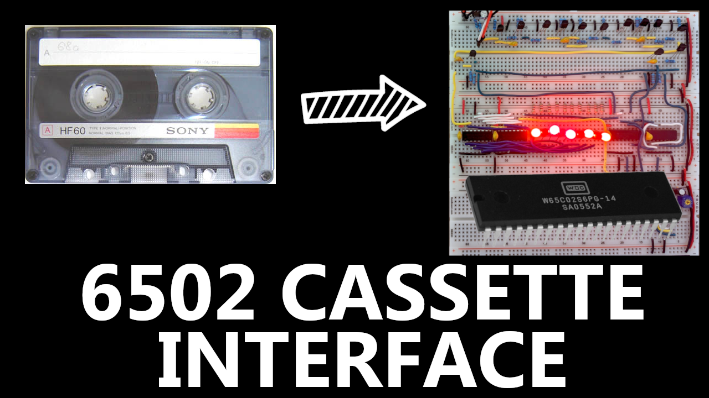

# The Curious Place - Kansas City Standard for the 6502
A comfortable place for code from my Kansas City Standard series on YouTube (https://www.youtube.com/@GregStrike).  

Kansas City Standard or BYTE Standard, was a standard developed by BYTE magazine back in in the late 70's. It was used to store computer data on standard, low-cost, audio cassette tapes. It was designed to allow common people to be able store data at home as there weren't many options to do so back around that time. There were even radio shows where they would broadcast out Kansas City Standard formatted audio and nerds like you and I would tune in to, listen to the broadcast and record the last part of the show to "download" a new computer program!  It was an amazing time to be alive (not that I was)!

<!-- PROJECT LOGO -->
 

  

  <h3 align="center">Kansas City Standard for the 6502</h3>

<!-- GETTING STARTED -->
## Videos
* The Curious Place 001 - History of KCS & demodulation of audio to serial - https://youtu.be/6m7vDhscGzU
* The Curious Place 002 - Latching data to Shift Registers - https://youtu.be/ei_JZlPCJcM
* The Curious Place 003 - Connecting the circuit to the 6502 - (<a href="https://github.com/gstrike/CuriousPlace-KansasCityStandard/tree/master/Video-003">code</a>) - https://youtu.be/8Gw-JDOg_2I
